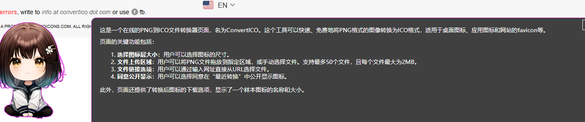

# Aru Screen Summary

一个基于 GPT-4 Vision 的智能截图解析工具。通过快捷键快速截取屏幕内容，并使用 AI 自动分析解释截图内容。

## 功能特点

- 🖼️ 多显示器支持的屏幕截图
- 🤖 基于 GPT-4 Vision 的智能解析
- ⌨️ 可自定义的全局快捷键
- 🎯 精确的区域选择
- 💾 历史记录查看
- 🔄 Token 使用统计
- 🌐 支持自定义 API 端点

## 使用方法

1. 启动程序后，会自动最小化到系统托盘
2. 默认快捷键 `Ctrl + Alt + P` 启动截图
3. 按住鼠标左键拖动选择区域
4. 点击"解析"按钮或按 Enter 键确认选择
5. 等待 AI 分析结果
6. 按 ESC 键或点击"取消"可退出截图

## 设置说明

双击托盘图标或右键菜单点击"设置"可以打开设置界面：

- API 设置：配置 OpenAI API 密钥和端点
- 快捷键设置：自定义截图快捷键
- 历史记录：查看历史解析记录和 Token 使用情况

## 系统要求

- Windows 10/11
- [.NET 7.0 Desktop Runtime](https://dotnet.microsoft.com/download/dotnet/7.0) (必需)
- OpenAI API 密钥（支持 GPT-4 Vision）

## 安装说明

1. 下载最新的安装包
2. 运行安装程序
3. 首次运行时配置 API 密钥
4. 开始使用

## 使用示例

1. 截取代码片段：
   - 使用快捷键选择代码区域
   - AI 会解释代码功能和逻辑

2. 截取错误信息：
   - 选择错误信息区域
   - AI 会分析错误原因和解决方案

3. 截取文档内容：
   - 选择文档区域
   - AI 会总结主要内容和要点

## 注意事项

- 请确保 API 密钥配置正确
- 建议合理设置 Token 限制
- 注意保护 API 密钥安全

## 开发技术

- C# WinForms
- .NET 7.0
- OpenAI GPT-4 Vision API

## 许可证

MIT License

## 作者

[Oyaxira](https://github.com/Oyaxira)

## 更新日志

### v1.0.0
- 初始版本发布
- 支持多显示器截图
- 支持自定义快捷键
- 支持历史记录查看

## 运行环境要求

- Windows 10/11
- [.NET 7.0 Desktop Runtime](https://dotnet.microsoft.com/download/dotnet/7.0) (必需)
- OpenAI API 密钥（支持 GPT-4 Vision）
